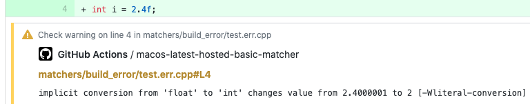

[](https://github.com/lukka/run-cmake/actions)

# Before using this action, consider writing a _pure_ workflow!

Before using this action, please consider reading and learning how to write a workflow which is directly using the well known tools you can run on your own machine, without relying on GitHub actions that you cannot run on your development machine.
You can read more in this issue about it: https://github.com/lukka/run-cmake/issues/41

# [The **run-cmake** action for using CMake on GitHub](https://github.com/marketplace/actions/run-cmake)

Build C++ software with the multi-platform **run-cmake** action by running [CMake](https://cmake.org) on GitHub workflows. [Samples](#samples) provided use [GitHub hosted runners](https://help.github.com/en/actions/automating-your-workflow-with-github-actions/virtual-environments-for-github-hosted-runners) and [Caching](https://help.github.com/en/actions/automating-your-workflow-with-github-actions/caching-dependencies-to-speed-up-workflows).

Good companions are the [run-vcpkg](https://github.com/marketplace/actions/run-vcpkg) action and the [get-cmake](https://github.com/marketplace/actions/get-cmake) action.

 ## User Manual
 * [Quickstart](#quickstart)
    * [Flowchart](#flowchart)
 * [The <strong>run-cmake</strong> action](#run-cmake)
 * [Action reference: all input/output parameters](#reference)
 * [Samples](#samples)
 * [Projects](#projects)

 ## Developer Manual
 * [Developers information](#developers-information)
   * [Prerequisites](#prerequisites)
   * [Packaging](#packaging)
   * [Testing](#testing)
  * [Contributing](#contributing)
  * [License](#license)

## <a id='quickstart'>Quickstart</a>

It is __highly recommended__ to use both [vcpkg as a submodule](https://github.com/lukka/run-vcpkg/#vcpkgsubmodule) and a [vcpkg.json](https://github.com/lukka/run-vcpkg/#vcpkgjson) manifest file to declaratively specify the dependencies.

```yaml
  # Sample when vcpkg is a submodule of your repository (highly recommended!)

jobs: 
  build:
    env:
      buildDir: '${{ github.workspace }}/build'
    steps:
      # Cache/Restore the vcpkg's build artifacts using a vcpkg.json manifest.
      - name: Run vcpkg
        uses: lukka/run-vcpkg@v6
        with:
          # Just install vcpkg for now, do not install any ports in this step yet.
          setupOnly: true
          # Location of the vcpkg as submodule of the repository.
          vcpkgDirectory: '${{ github.workspace }}/vcpkg'
          # Since the cache must be invalidated when content of the vcpkg.json file changes, let's
          # compute its hash and append this to the computed cache's key.
          appendedCacheKey: ${{ hashFiles( '**/vcpkg.json' ) }}
          vcpkgTriplet: ${{ matrix.triplet }}
          # Ensure the vcpkg artifacts are cached, they are generated in the 'CMAKE_BINARY_DIR/vcpkg_installed'.
          additionalCachedPaths: ${{ env.buildDir }}/vcpkg_installed
      - name: 'Run CMake with Ninja, install dependencies with vcpkg, build with CMake'
        uses: lukka/run-cmake@v3
        with:
          cmakeListsOrSettingsJson: CMakeListsTxtAdvanced
          cmakeListsTxtPath: '${{ github.workspace }}/cmakesettings.json/CMakeLists.txt'
          useVcpkgToolchainFile: true
          cmakeAppendedArgs: '-GNinja'
          buildDirectory: ${{ env.buildDir }}
          # Or build multiple configurations out of a CMakeSettings.json file created with Visual Studio.
          # cmakeListsOrSettingsJson: CMakeSettingsJson
          # cmakeSettingsJsonPath: '${{ github.workspace }}/cmakesettings.json/CMakeSettings.json'
          # configurationRegexFilter: '${{ matrix.configuration }}'
```
### <a id='flowchart'>Flowchart</a>


## <a id='run-cmake'>The ***run-cmake*** action</a>

Features:
  - run `cmake` to generate project files and to build the projects. Look to <a href=#samples>samples</a> and to <a href="#flowchart">flowchart</a> for details.
  - Automatic dump of log files created by `CMake` (e.g., `CMakeOutput.log`) and `vcpkg`. The content of those files flow into the workflow output log.
  - Annotations for CMake errors/warnings and for build (gcc/msvc/clang) errors/warning are created inline in the changed source files the build run for, e.g.: 

## <a id='reference'>Action reference: all input/output parameters</a>

Description of all input parameters: 
[action.yml](https://github.com/lukka/run-cmake/blob/main/action.yml)

## <a id="samples">Samples</a>

[View the workflows based on the run-cmake and run-vcpkg actions](https://github.com/lukka/CppBuildTasks-Validation/actions).

|CMakeLists.txt samples | |
|----------|-------|
[Linux/macOS/Windows, hosted runner, basic](https://github.com/lukka/CppBuildTasks-Validation/blob/master/.github/workflows/hosted-basic.yml)| [](https://github.com/lukka/CppBuildTasks-Validation/actions)
[Linux/macOS/Windows, hosted runner, advanced](https://github.com/lukka/CppBuildTasks-Validation/blob/master/.github/workflows/hosted-advanced.yml)| [](https://github.com/lukka/CppBuildTasks-Validation/actions)
[Linux/macOS/Windows, hosted runner, with cache and vcpkg as submodule](https://github.com/lukka/CppBuildTasks-Validation/blob/master/.github/workflows/hosted-basic-cache-submod_vcpkg.yml)| [](https://github.com/lukka/CppBuildTasks-Validation/actions)

|CMakeSettings.json samples | |
|----------|-------|
[Linux/macOS/Windows, hosted runner, with cache and vcpkg as submodule](https://github.com/lukka/CppBuildTasks-Validation/blob/master/.github/workflows/hosted-cmakesettingsjson-cache-submod_vcpkg.yml)| [](https://github.com/lukka/CppBuildTasks-Validation/actions)

## <a id='projects'>Real world project samples</a>
|Project|Platform(s)| |
|----------|-------|-|
|[CppOpenGLWebAssemblyCMake](https://github.com/lukka/CppOpenGLWebAssemblyCMake) |[WASM/Linux/macOS](https://github.com/lukka/CppOpenGLWebAssemblyCMake/blob/master/.github/workflows/build.yml) | [](https://github.com/lukka/CppOpenGLWebAssemblyCMake/actions)
|[quiniouben/vban](https://github.com/quiniouben/vban/) | [Windows/Linux](https://github.com/quiniouben/vban/blob/master/.github/workflows/main.yml) | [](https://github.com/quiniouben/vban/actions)
|[OPM/ResInsight](https://github.com/OPM/ResInsight/) | [Windows/Linux](https://github.com/OPM/ResInsight/blob/dev/.github/workflows/main.yml) | [](https://github.com/OPM/ResInsight/actions)
|[Mudlet/Mudlet](https://github.com/Mudlet/Mudlet) | [Linux/macOS/Windows](https://github.com/Mudlet/Mudlet/blob/development/.github/workflows/build-mudlet.yml) | [](https://github.com/Mudlet/Mudlet/actions) 
|[otland/forgottenserver](https://github.com/otland/forgottenserver) | [Linux/macOS/Windows](https://github.com/otland/forgottenserver/blob/master/.github/workflows/build-vcpkg.yml) | [](https://github.com/otland/forgottenserver/actions)
|[Element-0/ElementZero](https://github.com/Element-0/ElementZero) | [Windows](https://github.com/Element-0/ElementZero/blob/master/.github/workflows/ci.yml) | [](https://github.com/Element-0/ElementZero/actions)
|[assimp/assimp](https://github.com/assimp/assimp) |[Linux/macOS/Windows](https://github.com/assimp/assimp/blob/master/.github/workflows/ccpp.yml) | [](https://github.com/assimp/assimp/actions)
|[sony/nmos-cpp](https://github.com/sony/nmos-cpp) | [Linux/macOS/Windows](https://github.com/sony/nmos-cpp/blob/master/.github/workflows/build-test.yml) | [](https://github.com/sony/nmos-cpp/actions)
|[RaftLib/RaftLib](https://github.com/RaftLib/RaftLib) | [Linux/macOS/Windows](https://github.com/RaftLib/RaftLib/blob/master/.github/workflows/main.yml) | [](https://github.com/RaftLib/RaftLib/actions)
|[zealdocs/zeal](https://github.com/zealdocs/zeal) | [Linux/Windows](https://github.com/zealdocs/zeal/blob/master/.github/workflows/build-check.yml) | [](https://github.com/zealdocs/zeal/actions)
|[marian-nmt/marian-dev](https://github.com/marian-nmt/marian-dev) | [Windows](https://github.com/marian-nmt/marian-dev/blob/master/.github/workflows/windows.yml)/[Linux](https://github.com/marian-nmt/marian-dev/blob/master/.github/workflows/ubuntu.yml)/[macOS](https://github.com/marian-nmt/marian-dev/blob/master/.github/workflows/macos.yml)|[](https://github.com/marian-nmt/marian-dev/actions/) [](https://github.com/marian-nmt/marian-dev/actions/) [](https://github.com/marian-nmt/marian-dev/actions/) 
|[GrinPlusPlus](https://github.com/GrinPlusPlus/GrinPlusPlus) | [Linux/Windows/macOS](https://github.com/GrinPlusPlus/GrinPlusPlus/blob/master/.github/workflows/ci.yml) | [](https://github.com/GrinPlusPlus/GrinPlusPlus/actions/)
|[OpenTDD](https://github.com/OpenTTD/OpenTTD) | [Windows/macOS](https://github.com/OpenTTD/OpenTTD/blob/master/.github/workflows/ci-build.yml) | [](https://github.com/OpenTTD/OpenTTD/actions/)


# Developers information

## Prerequisites
[gulp 4](https://www.npmjs.com/package/gulp4) globally installed.

### Setup for GitHub Registry public packages

`run-vcpkg` depends on public NPM packages published by [lukka/run-cmake-vcpkg-action-libs](https://github.com/lukka/run-cmake-vcpkg-action-libs) in the [GitHub Packages registry](https://docs.github.com/en/free-pro-team@latest/packages/using-github-packages-with-your-projects-ecosystem/configuring-npm-for-use-with-github-packages).
Unexpectedly, a public package still requires authentication when downloading it, hence if you want to `npm install` those packages correctly, you need to obtain a token with `read:packages` scope. Then create in the root of the repository a `.npmrc` file with the following content:

   //npm.pkg.github.com/:_authToken=YOURTOKEN
   @lukka:registry=https://npm.pkg.github.com/

__Note__: **Never commit this `.npmrc` file!**

## Build and lint
Build with `tsc` running:

 > npm run build

Launch `lint` by:

 > npm run lint

## Packaging
To build, lint validate and package the extension for release purpose, run:

  > npm run pack

## Testing

To build, pack and test:
 
 > npm run test

 To run test directly:
 
 > jest

Validation tests on various scenarios are run using the workflows of the [Samples](#samples).

## <a id='contributing'>Contributing</a>

The software is provided as is, there is no warranty of any kind. All users are encouraged to improve the [source code](https://github.com/lukka/run-cmake) with fixes and new features.

# License
All the content in this repository is licensed under the [MIT License](LICENSE.txt).

Copyright (c) 2019-2020-2021 Luca Cappa

# Donating

Other than submitting a pull request, [donating](paypal.me/lucappa) is another way to contribute to this project.
